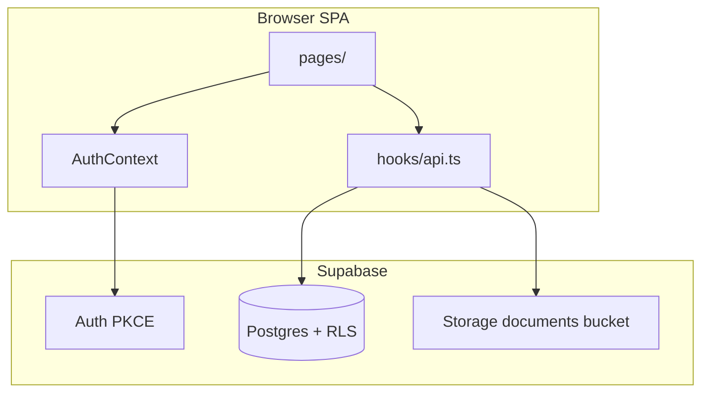
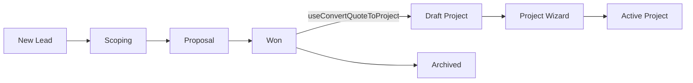

# OXUS Cloud — AI Developer Guide

Internal operating system for a web-development agency. This document maps **existing features**, **technical architecture**, and **conventions** so an AI agent (or human developer) can extend the app safely without re-discovering the codebase.

---

## Product overview

**OXUS Cloud** (codename: Agency OS) is a single-workspace CRM + project delivery + billing tool for agency staff. All authenticated team members share one data space — there is no multi-tenant org isolation in the current model.

Primary user journeys:

1. **Sales** — capture leads in Pipeline → scope → proposal → win → convert to project
2. **Delivery** — create/manage projects (draft wizard or manual), assign team contacts, track health/progress
3. **Relationships** — maintain organizations and people (clients, contractors, agents)
4. **Money** — invoices with lifecycle statuses, finance ledger for cash flow
5. **Operations** — calendar, global search, dashboard metrics

Currency display defaults to **EUR** (`formatEUR` in `src/lib/currency.ts`).

---

## Repository layout

```
oxus-cloud/                          # pnpm monorepo root
├── package.json                     # `pnpm dev` runs the app
├── pnpm-workspace.yaml
└── artifacts/oxus-cloud/            # ← THE APP (all frontend + Supabase migrations)
    ├── src/
    │   ├── App.tsx                  # Routes + providers
    │   ├── pages/                   # Route-level screens
    │   ├── components/              # Shared UI, forms, collab panels
    │   ├── hooks/api.ts             # ALL Supabase data access (React Query)
    │   ├── contexts/AuthContext.tsx
    │   └── lib/                     # Types, Supabase client, helpers
    ├── supabase/migrations/         # Postgres schema (0001–0009)
    ├── .env.example
    └── vite.config.ts
```

**Run locally:**

```bash
pnpm install          # from repo root
cp artifacts/oxus-cloud/.env.example artifacts/oxus-cloud/.env
# Fill VITE_SUPABASE_URL + VITE_SUPABASE_PUBLISHABLE_KEY
pnpm dev              # Vite on port 5173 by default
pnpm --filter @workspace/oxus-cloud run typecheck
```

There is **no custom backend API**. The React SPA talks directly to Supabase (Postgres + Auth + Storage) via `@supabase/supabase-js`.

---

## Tech stack

| Layer | Choice |
|-------|--------|
| UI | React 19, TypeScript |
| Build | Vite 6 |
| Routing | [wouter](https://github.com/molefrog/wouter) (`Switch` / `Route` / `useLocation`) |
| Server state | TanStack React Query v5 |
| Backend | Supabase (Auth PKCE, Postgres, Storage, RLS) |
| Styling | Tailwind CSS v4 (`@tailwindcss/vite`), CSS variables in `index.css` |
| Components | Radix UI primitives in `src/components/ui/` (shadcn-style) |
| Forms | Custom `FormKit` + `react-hook-form` in some places; mostly controlled state |
| Validation | Zod + `src/lib/validation.ts` (auth forms) |
| DnD | `@dnd-kit/*` (Pipeline + Projects kanban) |
| Charts | Recharts (Finance page) |
| Motion | Framer Motion (page transitions in `AppShell`) |
| Icons | Lucide React |
| Package manager | pnpm workspaces |

**Path alias:** `@/` → `src/` (configured in `vite.config.ts`).

**Deploy note:** `BASE_PATH` env var sets Vite `base`; wouter uses `import.meta.env.BASE_URL` for sub-path hosting.

---

## Application bootstrap

```tsx
// App.tsx provider tree
QueryClientProvider
  └── AuthProvider          // Supabase session
        └── TooltipProvider
              └── WouterRouter
                    └── Routes
              └── Toaster
```

Protected routes wrap pages in `RequireAuth` → `AppShell` (sidebar + top bar + animated content).

---

## Authentication

**Implementation:** `src/contexts/AuthContext.tsx` + `src/components/auth/RouteGuards.tsx`

| Route | Guard | Purpose |
|-------|-------|---------|
| `/login`, `/signup`, `/forgot-password` | `RedirectIfAuthenticated` | Bounce logged-in users to `/` |
| All app routes | `RequireAuth` | Redirect to `/login?next=…` |
| `/reset-password` | None (recovery flow) | Password reset after email link |

**Auth methods:** email/password sign-in, sign-up (optional email confirmation), password reset, update password, sign-out, delete own account (`delete_own_account` RPC).

**Session handling:**

- PKCE flow, persisted session, auto token refresh (`src/lib/supabase.ts`)
- `PASSWORD_RECOVERY` event sets `isRecovering` → forces `/reset-password` before app access
- `useAutoKickOut()` in `AppShell` redirects on session loss (e.g. another tab sign-out)

**Profiles:** On sign-up, trigger `handle_new_user()` creates a row in `public.profiles` mirroring `auth.users`. App users are **profiles**; role is `admin` | `member` (not heavily enforced in UI yet).

---

## Routes reference

| Path | Page | Description |
|------|------|-------------|
| `/` | Dashboard | Metrics, active projects, activity feed |
| `/pipeline` | Pipeline | Quote kanban (5 stages), drag-and-drop |
| `/quotes` | Quotes | Quote table + metrics, filters |
| `/quotes/new` | QuoteForm | Create quote |
| `/quotes/:id` | QuoteDetail | Quote detail + collab panels |
| `/projects` | Projects | Table + kanban tabs, draft badges |
| `/projects/new` | ProjectWizard | 2-step create wizard |
| `/projects/:id` | ProjectDetail | Detail view (drafts → wizard) |
| `/projects/:id/edit` | ProjectWizard | Edit existing project |
| `/calendar` | Calendar | Month grid + today agenda |
| `/team` | Team | Contractor roster (from Contacts) |
| `/contacts` | Contacts | People + Organizations tabs |
| `/technologies` | Technologies | CRUD tech tags |
| `/invoices` | Invoices | Billing lifecycle, priority cards |
| `/finance` | Finance | Transactions, charts |
| `/settings` | Settings | Profile, password, delete account |
| `/login`, `/signup`, `/forgot-password`, `/reset-password` | Auth pages | |

---

## Feature catalog (by area)

### Dashboard (`/`)

- **Metrics:** active projects (in-progress, non-draft), pending invoice total, active proposals count, collected MTD
- **Today at OXUS:** top 3 active projects with progress, budget, team avatars
- **Recent activity:** last 5 rows from `activities` table
- **Quick action:** Create Project → `/projects/new`

### Pipeline (`/pipeline`)

- Kanban columns: `new-lead` → `scoping` → `proposal` → `won` → `archived`
- Drag-and-drop reorder + stage change via `@dnd-kit` + `useUpdateQuoteStage`
- **QuoteDrawer:** side panel for quick view/edit
- **ConvertQuoteDialog:** when moving to Won — creates draft project, links `converted_project_id`, sets stage `won`
- Card shows: org name, POC, project type, budget, urgency, tags, age in stage, next action

### Quotes (`/quotes`)

- Table view of the **same** `quotes` entity as Pipeline
- Search + stage filter
- Metrics: proposal value, won value, open count, conversion rate
- Row actions: view drawer, mark won, navigate to detail

### Quote form & detail

- **QuoteForm:** auto-number `QT-{year}-{NNN}`, org/POC/tech/user selects, project type enum, budget, urgency, tags, project name/description
- **QuoteDetail:** full field display, Mark as Won, link to converted project, **Comments / Tasks / Attachments** panels

### Projects (`/projects`)

- **Tabs:** List (DataTable) | Board (kanban by status: planning, in-progress, on-hold, completed)
- Draft projects show badge; board/table both support DnD status changes
- Filters and progress/budget/health display

### Project wizard & detail

- **2 steps:** (1) Main info — name, description, org, POC, tech, type, budget, status, priority, dates, owner (profile), team (contact multi-select); (2) Documents — upload via `ProjectDocuments`
- Saves as **draft** (`is_draft: true`, `draft_step`) until finalized (`is_draft: false`)
- **ProjectDetail:** if draft → renders wizard; else read-only detail with edit button, health badge, progress, collab panels, documents

### Quote → Project conversion

`useConvertQuoteToProject` in `hooks/api.ts`:

1. Inserts project with fields copied from quote (`source_quote_id`, org, POC, tech, budget, etc.)
2. Sets `is_draft: true`, `draft_step: 1`
3. Updates quote: `converted_project_id`, `stage: 'won'`

User completes setup in Project Wizard.

### Contacts (`/contacts`)

- **People tab:** contacts table (type, relationship strength, company, last contact)
- **Organizations tab:** clients table (name, website, industry)
- Entity drawers for view; create dialogs
- Deep links: `?tab=organizations&new=1` (used by SearchableSelect "add new")

**Contact types in app:** `client` | `contractor` | `agent` (`CONTACT_TYPES` in `types.ts`). DB allows additional legacy values (`lead`, `partner`, `vendor`).

**Contractor fields on contacts:** job_title, hourly_rate, availability, location, employment_type, stack[]

### Team (`/team`)

- **Important:** UI roster = `contacts` where `type === 'contractor'`, NOT the `team_members` table
- Card grid + table, availability badges, stack tags, create contractor dialog

### Technologies (`/technologies`)

- Simple CRUD list with name + color swatch
- Referenced by quotes and projects

### Calendar (`/calendar`)

- Month view grid + "Today" agenda sidebar
- Event types: meeting, design, internal, milestone
- Attendees = app users (`profiles`) via `event_user_attendees`
- Create event dialog with date pre-fill from grid click

### Invoices (`/invoices`)

- Priority cards for overdue / due soon (uses `src/lib/invoices.ts` helpers)
- Full table with status filters, date range, search, pagination
- Statuses: draft, sent, viewed, partial, overdue, paid
- Line items on create; `amount_paid` for partial payments
- Entity drawer for detail; status update actions (mark sent, paid, etc.)
- **`stripe_status` field exists but Stripe is not integrated** — UI placeholder only

### Finance (`/finance`)

- Manual **transactions** ledger (income/expense, category, date)
- Area chart: monthly income vs expenses (current year)
- Pie chart: expense categories (current month)
- Create transaction dialog

### Settings (`/settings`)

- Update display name (syncs `profiles` + auth `user_metadata`)
- Change password with strength rules (`src/lib/password.ts`)
- Delete account (danger zone, confirms by typing email)

### Global search (TopBar)

- **Cmd/Ctrl+K** command palette
- Searches app pages + indexed records (clients, contacts, projects, quotes, invoices, team_members)
- Implemented in `GlobalSearch.tsx` + `lib/search.ts`

---

## Collaboration features (quotes & projects)

Polymorphic entities keyed by `(entity_type, entity_id)` where `entity_type ∈ ('quote', 'project')`.

| Feature | Table | Storage | UI |
|---------|-------|---------|-----|
| Comments | `comments` | — | `CommentsPanel` |
| Tasks | `tasks` | — | `TasksPanel` (todo/doing/done) |
| Attachments | `attachments` | `documents` bucket | `AttachmentsPanel`, `ProjectDocuments` |

**Document types:** attachment, msa, nda, sow, other. Uploading a new active SOW deactivates the previous SOW (app logic in `useUploadAttachment`).

Files stored at `{entity_type}/{entity_id}/{timestamp}_{filename}` with signed URLs (1h TTL).

---

## Data model (Supabase / Postgres)

### Core entities

```
auth.users ──1:1── profiles (app users, team directory)
clients (organizations)
contacts (people) ──FK──> clients
technologies
quotes (unified pipeline + proposals; was `deals`)
projects ──FK──> quotes (source_quote_id), clients, contacts, technologies, profiles (owner)
invoices ──> invoice_line_items
calendar_events ──> event_user_attendees ──> profiles
transactions
activities (audit feed)
comments, tasks, attachments (polymorphic)
```

### Junction / assignment tables

| Table | Links | Status |
|-------|-------|--------|
| `project_contact_assignees` | project ↔ contact | **Primary** — team on projects |
| `project_user_assignees` | project ↔ profile | Legacy; still writable in `useUpdateProject` |
| `project_assignees` | project ↔ team_members | **Legacy** — original schema |
| `event_user_attendees` | event ↔ profile | **Active** |
| `event_attendees` | event ↔ team_members | **Legacy** |

### Quotes (unified entity)

Renamed from `deals` in migration `0004_unify_quotes.sql`. Old proposal-style `quotes` + `quote_line_items` tables were dropped.

Key fields: `stage`, `budget`, `company`, `organization_id`, `point_of_contact_id`, `technology_id`, `assigned_user_id`, `converted_project_id`, `project_name`, `project_description`, `position`, `stage_entered_at`, `tags`, `urgency`, `next_action`.

Stages: `new-lead` | `scoping` | `proposal` | `won` | `archived`

### Projects

Statuses: `planning` | `in-progress` | `on-hold` | `completed`  
Health: `on-track` | `at-risk` | `off-track`  
Draft fields: `is_draft`, `draft_step`

Project types (CHECK constraint): Web App, Landing Page, IT Consulting, Bug Fixing

### Security (RLS)

- **Every business table** has RLS enabled
- Access gate: `public.is_team_member()` — user must have a `profiles` row
- **Shared workspace:** all team members have full read/write on business data (no row-level ownership policies except profiles self-update)
- **Storage:** private `documents` bucket; same team-member check
- **Never use `service_role` key in the browser** — only `VITE_SUPABASE_PUBLISHABLE_KEY`

Migrations: `0001` schema → `0002` RLS → `0003` user assignments + delete account → `0004` unify quotes → `0005` collab tables → `0006` project drafts → `0007` storage RLS → `0008` contact/quote fields → `0009` project_contact_assignees

---

## Data access layer (`src/hooks/api.ts`)

**This is the single source of truth for all CRUD.** When adding a feature:

1. Add/adjust migration + RLS policy
2. Extend `src/lib/types.ts` (snake_case fields matching DB)
3. Add query key to `qk` object
4. Add `useQuery` / `useMutation` hooks
5. Invalidate related keys in `onSuccess`

### Query keys (`qk`)

```ts
clients, contacts, profiles, teamMembers, technologies,
quotes, projects, invoices, events, transactions, activities,
comments(entity, id), tasks(entity, id), attachments(entity, id)
```

### Notable hooks

| Hook | Purpose |
|------|---------|
| `useQuotes` / `useQuote` | Joins org, POC, technology, assigned_user |
| `useProjects` / `useProject` | Joins owner, team_contacts via `project_contact_assignees` |
| `useConvertQuoteToProject` | Quote won → draft project |
| `useUploadAttachment` | Storage upload + DB row + SOW supersession |
| `useDeleteOwnAccount` | RPC `delete_own_account` |

Errors throw `new Error(error.message)` — pages use `ErrorState` + `refetch`.

---

## UI patterns & conventions

### Page structure

Most pages follow:

```tsx
<PageHeader title subtitle actions breadcrumbs />
<MetricCard /> or filters
<DataTable /> or custom layout
<EmptyState | ErrorState | Skeleton variants from QueryStates />
```

### Forms

- **`FormKit`:** `Field`, `TextField`, `TextareaField`, `SelectField`, `FormDialog`
- **`SearchableSelect` / `SearchableMultiSelect`:** combobox with optional "create new" deep link
- **`refOptions.ts`:** `useOrganizationOptions`, `useContactOptions`, `useTechnologyOptions`, `useUserOptions`
- **`CreateDialogs.tsx`:** CreateClient, CreateContact, CreateInvoice, CreateEvent, CreateTransaction

### Status display

- **`StatusBadge`:** maps status strings to color variants
- **`ProjectHealthBadge`:** on-track / at-risk / off-track

### Naming

- DB + TypeScript domain types use **snake_case** (matches Supabase rows)
- React components use **PascalCase**
- `clients` table = "Organizations" in UI (`useOrganizations` alias)

### Styling tokens

Brand colors in CSS: `--logo-blue`, `--soft-green`, `--soft-red`, `--warm-yellow`. Sidebar uses `bg-sidebar` theme tokens.

---

## Environment variables

```env
VITE_SUPABASE_URL=https://your-project.supabase.co
VITE_SUPABASE_PUBLISHABLE_KEY=sb_publishable_xxx   # or legacy anon key
```

Optional: `PORT`, `BASE_PATH` (Vite), `REPL_ID` (Replit plugins).

---

## Legacy / dual-source areas (read before changing)

1. **`team_members` table vs contacts contractors**  
   Team **page** uses `contacts` (type=contractor). `team_members` table + `useTeamMembers` still exist and are used by GlobalSearch and CreateInvoiceDialog owner picker. Prefer contacts for new team/roster features.

2. **Project assignees**  
   Prefer `project_contact_assignees` (contacts). `project_user_assignees` and `project_assignees` are legacy paths still in schema/API.

3. **Calendar attendees**  
   App uses `event_user_attendees` (profiles). Old `event_attendees` (team_members) may still exist in DB from initial migration.

4. **Invoices / Stripe**  
   `stripe_status` column populated as `"Draft"` on create; no payment integration.

5. **Activities**  
   Table + `useActivities` exist; only Dashboard shows a small feed. No write hooks from UI yet.

6. **Export / Download buttons**  
   Some invoice/finance export UI may be presentational — verify before assuming backend exists.

---

## Checklist for AI agents adding features

### New database table

- [ ] `supabase migration new <name>` then write SQL
- [ ] Enable RLS + `is_team_member()` policy (match `0002` / `0007` pattern)
- [ ] Add types to `lib/types.ts`
- [ ] Regenerate or hand-update `lib/database.types.ts` if used
- [ ] Add hooks in `hooks/api.ts` with `qk` keys
- [ ] Add page/component UI with `QueryStates`

### New page

- [ ] Create component in `src/pages/`
- [ ] Register route in `App.tsx` inside `protectedPage()` unless public
- [ ] Add sidebar entry in `Sidebar.tsx` if primary nav
- [ ] Add to `APP_PAGES` in `lib/search.ts` for discoverability

### New form field on existing entity

- [ ] Migration to add column
- [ ] Update `types.ts`, hook input types, and relevant page/wizard
- [ ] Update `QUOTE_SELECT` / `PROJECT_SELECT` if joined data needed

### Auth-sensitive work

- Do not authorize via `user_metadata` in RLS
- Do not expose service role key
- Profile roles (`admin`/`member`) exist but are not widely enforced — discuss before adding admin-only UI

### Testing locally

```bash
pnpm --filter @workspace/oxus-cloud run typecheck
pnpm dev
# Apply migrations via Supabase CLI or dashboard against your project
```

---

## Key file index

| File | Role |
|------|------|
| `src/App.tsx` | Routes, providers |
| `src/hooks/api.ts` | All Supabase queries/mutations |
| `src/lib/types.ts` | Domain TypeScript types |
| `src/lib/supabase.ts` | Supabase client singleton |
| `src/contexts/AuthContext.tsx` | Auth state & methods |
| `src/components/auth/RouteGuards.tsx` | Protected route logic |
| `src/components/AppShell.tsx` | Layout shell |
| `src/components/forms/FormKit.tsx` | Form primitives |
| `src/components/forms/refOptions.ts` | Select option hooks |
| `src/components/collab/CollabPanels.tsx` | Comments, tasks, attachments |
| `src/lib/invoices.ts` | Invoice display helpers & types |
| `src/lib/search.ts` | Global search page list |
| `supabase/migrations/*.sql` | Schema source of truth |

---

## Architecture diagram





---

*Last generated from codebase state: June 2026. When in doubt, trust migrations + `hooks/api.ts` over this document.*
