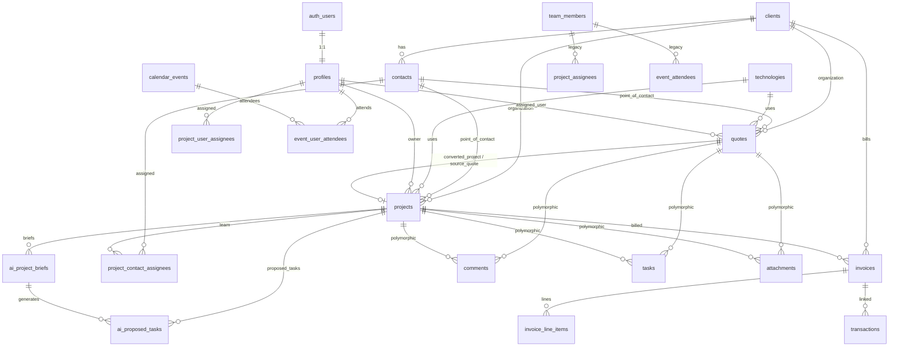

# OXUS Cloud — Database Schema

Postgres schema for **OXUS Cloud** (Agency OS), managed via Supabase migrations in `supabase/migrations/`.

**Source of truth:** migration SQL files (`0001`–`0010`). Regenerate TypeScript types with `supabase gen types` after schema changes.

---

## Overview

Single-workspace internal CRM + project delivery + billing for agency staff. All business data lives in the `public` schema. Every table has **Row Level Security (RLS)** enabled; access is gated by `public.is_team_member()` (user must have a `profiles` row).

| Extension | Purpose |
|-----------|---------|
| `pgcrypto` | `gen_random_uuid()` for surrogate PKs |

---

## Entity relationship diagram

---

## Migration history

| # | File | Summary |
|---|------|---------|
| 0001 | `agency_os_schema.sql` | Core tables, triggers, `team_member_stats` view |
| 0002 | `agency_os_rls.sql` | RLS on all business tables |
| 0003 | `user_assignments_and_account.sql` | User-based assignees; `delete_own_account()` RPC |
| 0004 | `unify_quotes.sql` | Rename `deals` → `quotes`; drop old proposal quotes; add `technologies` |
| 0005 | `collab_entities.sql` | `comments`, `tasks`, `attachments` (polymorphic) |
| 0006 | `projects_drafts.sql` | Project draft wizard + quote-conversion fields |
| 0007 | `storage_and_rls.sql` | RLS for new tables; private `documents` storage bucket |
| 0008 | `quote_project_contact_fields.sql` | Quote/project descriptions; contact contractor fields |
| 0009 | `project_contact_assignees.sql` | Project team via contacts (primary assignment model) |
| 0010 | `ai_project_briefs.sql` | AI-generated briefs and proposed tasks |

---

## Tables

### `profiles`

App users (agency staff). One row per `auth.users` row, created automatically on sign-up via `handle_new_user()` trigger.

| Column | Type | Constraints |
|--------|------|-------------|
| `id` | `uuid` | PK, FK → `auth.users(id)` ON DELETE CASCADE |
| `full_name` | `text` | |
| `email` | `text` | |
| `avatar_url` | `text` | |
| `role` | `text` | NOT NULL, default `'member'`, CHECK: `admin`, `member` |
| `created_at` | `timestamptz` | NOT NULL, default `now()` |
| `updated_at` | `timestamptz` | NOT NULL, default `now()` |

**RLS:** All authenticated users can SELECT; users may INSERT/UPDATE only their own row.

---

### `clients`

Organizations the agency works with.

| Column | Type | Constraints |
|--------|------|-------------|
| `id` | `uuid` | PK, default `gen_random_uuid()` |
| `name` | `text` | NOT NULL |
| `website` | `text` | |
| `industry` | `text` | |
| `notes` | `text` | |
| `created_by` | `uuid` | FK → `auth.users(id)` ON DELETE SET NULL |
| `created_at` | `timestamptz` | NOT NULL, default `now()` |
| `updated_at` | `timestamptz` | NOT NULL, default `now()` |

**Indexes:** `name`, `created_by`

---

### `contacts`

People — clients, leads, contractors, partners, vendors. Contractor/team fields were added in migration 0008 so the Team directory can be sourced from contacts with `type = 'contractor'`.

| Column | Type | Constraints |
|--------|------|-------------|
| `id` | `uuid` | PK |
| `name` | `text` | NOT NULL |
| `type` | `text` | NOT NULL, default `'lead'`, CHECK: `client`, `lead`, `contractor`, `partner`, `vendor` |
| `company` | `text` | |
| `client_id` | `uuid` | FK → `clients(id)` ON DELETE SET NULL |
| `email` | `text` | |
| `phone` | `text` | |
| `relationship_strength` | `text` | NOT NULL, default `'new'`, CHECK: `strong`, `medium`, `weak`, `new` |
| `source` | `text` | |
| `notes` | `text` | |
| `last_contact_at` | `timestamptz` | |
| `job_title` | `text` | *(0008)* |
| `hourly_rate` | `numeric` | *(0008)* |
| `availability` | `text` | *(0008)* |
| `location` | `text` | *(0008)* |
| `employment_type` | `text` | *(0008)* |
| `stack` | `text[]` | NOT NULL, default `'{}'` *(0008)* |
| `created_by` | `uuid` | FK → `auth.users(id)` ON DELETE SET NULL |
| `created_at` | `timestamptz` | NOT NULL |
| `updated_at` | `timestamptz` | NOT NULL |

**Indexes:** `client_id`, `type`, `created_by`

---

### `team_members` *(legacy)*

Original agency roster table. Distinct from `profiles` — a roster entry need not have an app login. The app now prefers `contacts` (type `contractor`) for team directory; this table remains in schema for backward compatibility.

| Column | Type | Constraints |
|--------|------|-------------|
| `id` | `uuid` | PK |
| `name` | `text` | NOT NULL |
| `job_title` | `text` | |
| `email` | `text` | |
| `avatar_url` | `text` | |
| `location` | `text` | |
| `employment_type` | `text` | NOT NULL, default `'employee'`, CHECK: `employee`, `contractor` |
| `status` | `text` | NOT NULL, default `'active'`, CHECK: `active`, `inactive` |
| `availability` | `text` | NOT NULL, default `'full'`, CHECK: `full`, `partial`, `busy`, `unavailable` |
| `hourly_rate` | `numeric(10,2)` | |
| `stack` | `text[]` | NOT NULL, default `'{}'` |
| `unpaid_invoices` | `integer` | NOT NULL, default `0`, CHECK ≥ 0 |
| `notes` | `text` | |
| `profile_id` | `uuid` | FK → `profiles(id)` ON DELETE SET NULL |
| `created_by` | `uuid` | FK → `auth.users(id)` ON DELETE SET NULL |
| `created_at` | `timestamptz` | NOT NULL |
| `updated_at` | `timestamptz` | NOT NULL |

**Indexes:** `status`, `created_by`

---

### `quotes`

Unified sales pipeline entity (renamed from `deals` in 0004). Replaces the original proposal-style `quotes` + `quote_line_items` tables.

| Column | Type | Constraints |
|--------|------|-------------|
| `id` | `uuid` | PK |
| `company` | `text` | NOT NULL |
| `client_id` | `uuid` | FK → `clients(id)` ON DELETE SET NULL *(legacy)* |
| `contact_id` | `uuid` | FK → `contacts(id)` ON DELETE SET NULL *(legacy)* |
| `contact_name` | `text` | *(legacy denormalized)* |
| `project_type` | `text` | CHECK: `Web App`, `Landing Page`, `IT Consulting`, `Bug Fixing` |
| `budget` | `numeric(12,2)` | NOT NULL, default `0` |
| `stage` | `text` | NOT NULL, default `'new-lead'`, CHECK: `new-lead`, `scoping`, `proposal`, `won`, `archived` |
| `urgency` | `text` | NOT NULL, default `'normal'`, CHECK: `low`, `normal`, `high` |
| `next_action` | `text` | |
| `tags` | `text[]` | NOT NULL, default `'{}'` |
| `owner_id` | `uuid` | FK → `team_members(id)` ON DELETE SET NULL *(legacy)* |
| `position` | `integer` | NOT NULL, default `0` — kanban ordering within stage |
| `stage_entered_at` | `timestamptz` | NOT NULL, default `now()` |
| `number` | `text` | *(0004)* |
| `organization_id` | `uuid` | FK → `clients(id)` ON DELETE SET NULL |
| `point_of_contact_id` | `uuid` | FK → `contacts(id)` ON DELETE SET NULL |
| `technology_id` | `uuid` | FK → `technologies(id)` ON DELETE SET NULL |
| `assigned_user_id` | `uuid` | FK → `profiles(id)` ON DELETE SET NULL |
| `converted_project_id` | `uuid` | FK → `projects(id)` ON DELETE SET NULL |
| `project_name` | `text` | *(0008)* — seeds converted project |
| `project_description` | `text` | *(0008)* |
| `created_by` | `uuid` | FK → `auth.users(id)` ON DELETE SET NULL |
| `created_at` | `timestamptz` | NOT NULL |
| `updated_at` | `timestamptz` | NOT NULL |

**Indexes:** `stage`, `client_id`, `owner_id`, `organization_id`, `point_of_contact_id`, `technology_id`, `assigned_user_id`

---

### `technologies`

Configurable technology list referenced by quotes and projects.

| Column | Type | Constraints |
|--------|------|-------------|
| `id` | `uuid` | PK |
| `name` | `text` | NOT NULL |
| `color` | `text` | |
| `created_by` | `uuid` | FK → `auth.users(id)` ON DELETE SET NULL |
| `created_at` | `timestamptz` | NOT NULL |
| `updated_at` | `timestamptz` | NOT NULL |

**Indexes:** `name`

---

### `projects`

Delivery work. Supports draft wizard (`is_draft`, `draft_step`) and conversion from quotes (`source_quote_id`).

| Column | Type | Constraints |
|--------|------|-------------|
| `id` | `uuid` | PK |
| `name` | `text` | NOT NULL |
| `client_id` | `uuid` | FK → `clients(id)` ON DELETE SET NULL *(legacy)* |
| `client_name` | `text` | *(denormalized)* |
| `status` | `text` | NOT NULL, default `'planning'`, CHECK: `planning`, `in-progress`, `on-hold`, `completed` |
| `priority` | `text` | NOT NULL, default `'medium'`, CHECK: `low`, `medium`, `high` |
| `health` | `text` | NOT NULL, default `'on-track'`, CHECK: `on-track`, `at-risk`, `off-track` |
| `risk` | `text` | NOT NULL, default `'low'`, CHECK: `none`, `low`, `medium`, `high` |
| `progress` | `integer` | NOT NULL, default `0`, CHECK 0–100 |
| `budget` | `numeric(12,2)` | NOT NULL, default `0` |
| `start_date` | `date` | |
| `deadline` | `date` | |
| `is_draft` | `boolean` | NOT NULL, default `false` *(0006)* |
| `draft_step` | `integer` | NOT NULL, default `1` *(0006)* |
| `source_quote_id` | `uuid` | FK → `quotes(id)` ON DELETE SET NULL *(0006)* |
| `organization_id` | `uuid` | FK → `clients(id)` ON DELETE SET NULL *(0006)* |
| `point_of_contact_id` | `uuid` | FK → `contacts(id)` ON DELETE SET NULL *(0006)* |
| `technology_id` | `uuid` | FK → `technologies(id)` ON DELETE SET NULL *(0006)* |
| `project_type` | `text` | CHECK: `Web App`, `Landing Page`, `IT Consulting`, `Bug Fixing` *(0006)* |
| `description` | `text` | *(0008)* |
| `owner_id` | `uuid` | FK → `profiles(id)` ON DELETE SET NULL *(0008)* |
| `created_by` | `uuid` | FK → `auth.users(id)` ON DELETE SET NULL |
| `created_at` | `timestamptz` | NOT NULL |
| `updated_at` | `timestamptz` | NOT NULL |

**Indexes:** `client_id`, `status`, `source_quote_id`, `is_draft`, `owner_id`

---

### `invoices`

Billing lifecycle.

| Column | Type | Constraints |
|--------|------|-------------|
| `id` | `uuid` | PK |
| `number` | `text` | NOT NULL |
| `client_id` | `uuid` | FK → `clients(id)` ON DELETE SET NULL |
| `client_name` | `text` | |
| `project_id` | `uuid` | FK → `projects(id)` ON DELETE SET NULL |
| `project` | `text` | |
| `amount` | `numeric(12,2)` | NOT NULL, default `0` |
| `amount_paid` | `numeric(12,2)` | NOT NULL, default `0` |
| `status` | `text` | NOT NULL, default `'draft'`, CHECK: `draft`, `sent`, `viewed`, `partial`, `overdue`, `paid` |
| `issue_date` | `date` | NOT NULL, default `current_date` |
| `due_date` | `date` | |
| `paid_date` | `date` | |
| `payment_method` | `text` | |
| `owner_id` | `uuid` | FK → `team_members(id)` ON DELETE SET NULL |
| `owner_name` | `text` | |
| `last_reminder_at` | `timestamptz` | |
| `stripe_status` | `text` | |
| `created_by` | `uuid` | FK → `auth.users(id)` ON DELETE SET NULL |
| `created_at` | `timestamptz` | NOT NULL |
| `updated_at` | `timestamptz` | NOT NULL |

**Indexes:** `client_id`, `project_id`, `status`, `due_date`

---

### `invoice_line_items`

| Column | Type | Constraints |
|--------|------|-------------|
| `id` | `uuid` | PK |
| `invoice_id` | `uuid` | NOT NULL, FK → `invoices(id)` ON DELETE CASCADE |
| `description` | `text` | NOT NULL |
| `amount` | `numeric(12,2)` | NOT NULL, default `0` |
| `position` | `integer` | NOT NULL, default `0` |
| `created_at` | `timestamptz` | NOT NULL |

**Indexes:** `invoice_id`

---

### `calendar_events`

| Column | Type | Constraints |
|--------|------|-------------|
| `id` | `uuid` | PK |
| `title` | `text` | NOT NULL |
| `event_date` | `date` | NOT NULL |
| `start_time` | `text` | |
| `end_time` | `text` | |
| `type` | `text` | NOT NULL, default `'meeting'`, CHECK: `meeting`, `design`, `internal`, `milestone` |
| `location` | `text` | |
| `color` | `text` | |
| `project_id` | `uuid` | FK → `projects(id)` ON DELETE SET NULL |
| `client_id` | `uuid` | FK → `clients(id)` ON DELETE SET NULL |
| `created_by` | `uuid` | FK → `auth.users(id)` ON DELETE SET NULL |
| `created_at` | `timestamptz` | NOT NULL |
| `updated_at` | `timestamptz` | NOT NULL |

**Indexes:** `event_date`

---

### `transactions`

Finance ledger. Positive `amount` = income, negative = expense.

| Column | Type | Constraints |
|--------|------|-------------|
| `id` | `uuid` | PK |
| `occurred_on` | `date` | NOT NULL, default `current_date` |
| `description` | `text` | NOT NULL |
| `amount` | `numeric(12,2)` | NOT NULL |
| `category` | `text` | NOT NULL, default `'Other'` |
| `type` | `text` | NOT NULL, default `'expense'`, CHECK: `income`, `expense` |
| `client_id` | `uuid` | FK → `clients(id)` ON DELETE SET NULL |
| `invoice_id` | `uuid` | FK → `invoices(id)` ON DELETE SET NULL |
| `created_by` | `uuid` | FK → `auth.users(id)` ON DELETE SET NULL |
| `created_at` | `timestamptz` | NOT NULL |
| `updated_at` | `timestamptz` | NOT NULL |

**Indexes:** `occurred_on`, `type`

---

### `activities`

Audit / activity feed across the workspace.

| Column | Type | Constraints |
|--------|------|-------------|
| `id` | `uuid` | PK |
| `kind` | `text` | NOT NULL, default `'default'`, CHECK: `success`, `info`, `warning`, `default` |
| `title` | `text` | NOT NULL |
| `description` | `text` | |
| `entity_type` | `text` | e.g. `invoice`, `quote`, `deal`, `project`, `contact` |
| `entity_id` | `uuid` | |
| `contact_id` | `uuid` | FK → `contacts(id)` ON DELETE SET NULL |
| `created_by` | `uuid` | FK → `auth.users(id)` ON DELETE SET NULL |
| `created_at` | `timestamptz` | NOT NULL |

**Indexes:** `created_at DESC`, `contact_id`

---

### `comments` *(polymorphic)*

| Column | Type | Constraints |
|--------|------|-------------|
| `id` | `uuid` | PK |
| `entity_type` | `text` | NOT NULL, CHECK: `quote`, `project` |
| `entity_id` | `uuid` | NOT NULL |
| `author_id` | `uuid` | FK → `profiles(id)` ON DELETE SET NULL |
| `body` | `text` | NOT NULL |
| `created_at` | `timestamptz` | NOT NULL |

**Indexes:** `(entity_type, entity_id)`

---

### `tasks` *(polymorphic)*

| Column | Type | Constraints |
|--------|------|-------------|
| `id` | `uuid` | PK |
| `entity_type` | `text` | NOT NULL, CHECK: `quote`, `project` |
| `entity_id` | `uuid` | NOT NULL |
| `title` | `text` | NOT NULL |
| `status` | `text` | NOT NULL, default `'todo'`, CHECK: `todo`, `doing`, `done` |
| `assignee_id` | `uuid` | FK → `profiles(id)` ON DELETE SET NULL |
| `due_date` | `date` | |
| `position` | `integer` | NOT NULL, default `0` |
| `created_at` | `timestamptz` | NOT NULL |
| `updated_at` | `timestamptz` | NOT NULL |

**Indexes:** `(entity_type, entity_id)`

---

### `attachments` *(polymorphic)*

Metadata for files in the `documents` storage bucket.

| Column | Type | Constraints |
|--------|------|-------------|
| `id` | `uuid` | PK |
| `entity_type` | `text` | NOT NULL, CHECK: `quote`, `project` |
| `entity_id` | `uuid` | NOT NULL |
| `doc_type` | `text` | NOT NULL, default `'attachment'`, CHECK: `attachment`, `msa`, `nda`, `sow`, `other` |
| `is_active` | `boolean` | NOT NULL, default `true` |
| `file_path` | `text` | NOT NULL |
| `file_name` | `text` | NOT NULL |
| `file_size` | `bigint` | |
| `mime_type` | `text` | |
| `uploaded_by` | `uuid` | FK → `profiles(id)` ON DELETE SET NULL |
| `created_at` | `timestamptz` | NOT NULL |

**Indexes:** `(entity_type, entity_id)`

File path convention: `{entity_type}/{entity_id}/{timestamp}_{filename}`

---

### `ai_project_briefs` *(0010)*

AI-generated project briefs from transcripts, descriptions, or manual input.

| Column | Type | Constraints |
|--------|------|-------------|
| `id` | `uuid` | PK |
| `project_id` | `uuid` | NOT NULL, FK → `projects(id)` ON DELETE CASCADE |
| `source_type` | `text` | NOT NULL, default `'manual'`, CHECK: `manual`, `zoom_transcript`, `project_description`, `other` |
| `source_text` | `text` | NOT NULL |
| `summary` | `text` | |
| `goals` | `text[]` | default `'{}'` |
| `scope_in` | `text[]` | default `'{}'` |
| `scope_out` | `text[]` | default `'{}'` |
| `risks` | `text[]` | default `'{}'` |
| `open_questions` | `text[]` | default `'{}'` |
| `qa_notes` | `text[]` | default `'{}'` |
| `raw_response` | `jsonb` | |
| `model` | `text` | |
| `status` | `text` | NOT NULL, default `'completed'`, CHECK: `pending`, `completed`, `failed` |
| `error_message` | `text` | |
| `created_by` | `uuid` | FK → `profiles(id)` ON DELETE SET NULL |
| `created_at` | `timestamptz` | NOT NULL |
| `updated_at` | `timestamptz` | NOT NULL |

**Indexes:** `project_id`, `created_at`

---

### `ai_proposed_tasks` *(0010)*

AI-suggested tasks derived from project briefs. Review workflow: `pending` → `accepted` / `rejected`.

| Column | Type | Constraints |
|--------|------|-------------|
| `id` | `uuid` | PK |
| `project_id` | `uuid` | NOT NULL, FK → `projects(id)` ON DELETE CASCADE |
| `brief_id` | `uuid` | FK → `ai_project_briefs(id)` ON DELETE CASCADE |
| `title` | `text` | NOT NULL |
| `description` | `text` | |
| `acceptance_criteria` | `text[]` | default `'{}'` |
| `qa_scenarios` | `jsonb` | default `'[]'` |
| `priority` | `text` | default `'medium'`, CHECK: `low`, `medium`, `high`, `urgent` |
| `confidence` | `numeric` | |
| `status` | `text` | NOT NULL, default `'pending'`, CHECK: `pending`, `accepted`, `rejected` |
| `raw_item` | `jsonb` | |
| `created_by` | `uuid` | FK → `profiles(id)` ON DELETE SET NULL |
| `created_at` | `timestamptz` | NOT NULL |
| `updated_at` | `timestamptz` | NOT NULL |

**Indexes:** `project_id`, `brief_id`, `status`

---

## Junction tables

| Table | Links | PK | Status |
|-------|-------|-----|--------|
| `project_contact_assignees` | project ↔ contact | `(project_id, contact_id)` | **Primary** — team on projects |
| `project_user_assignees` | project ↔ profile | `(project_id, user_id)` | Legacy; still writable |
| `project_assignees` | project ↔ team_member | `(project_id, team_member_id)` | **Legacy** |
| `event_user_attendees` | event ↔ profile | `(event_id, user_id)` | **Active** |
| `event_attendees` | event ↔ team_member | `(event_id, team_member_id)` | **Legacy** |

All junction tables CASCADE on parent delete.

---

## Views

### `team_member_stats`

`security_invoker = true` — active project count per team member.

| Column | Description |
|--------|-------------|
| `team_member_id` | FK to `team_members.id` |
| `active_projects` | Count of projects in `planning`, `in-progress`, or `on-hold` |

---

## Functions

| Function | Access | Purpose |
|----------|--------|---------|
| `set_updated_at()` | trigger only | Sets `updated_at = now()` on UPDATE |
| `handle_new_user()` | trigger only | Mirrors `auth.users` → `profiles` on sign-up |
| `is_team_member()` | authenticated | Returns true if `auth.uid()` has a `profiles` row; used in RLS |
| `delete_own_account()` | authenticated RPC | Deletes the caller's `auth.users` row |

---

## Storage

| Bucket | Public | Access |
|--------|--------|--------|
| `documents` | No | Authenticated team members via `documents_team_all` policy on `storage.objects` |

---

## Row Level Security

| Pattern | Tables |
|---------|--------|
| Team read/write (`is_team_member()`) | All business tables listed above |
| Self-update only | `profiles` (SELECT all authenticated; UPDATE/INSERT own row) |
| Storage team access | `storage.objects` where `bucket_id = 'documents'` |

Anonymous (`anon`) role has no access to business data.

---

## Dropped tables

These existed in early migrations but were removed:

| Table | Removed in | Replaced by |
|-------|------------|-------------|
| `deals` | 0004 (renamed) | `quotes` |
| `quotes` (original proposal style) | 0004 | Unified pipeline `quotes` |
| `quote_line_items` | 0004 | — (line items no longer used) |

---

*Generated from migrations 0001–0010. Last updated: June 2026.*
